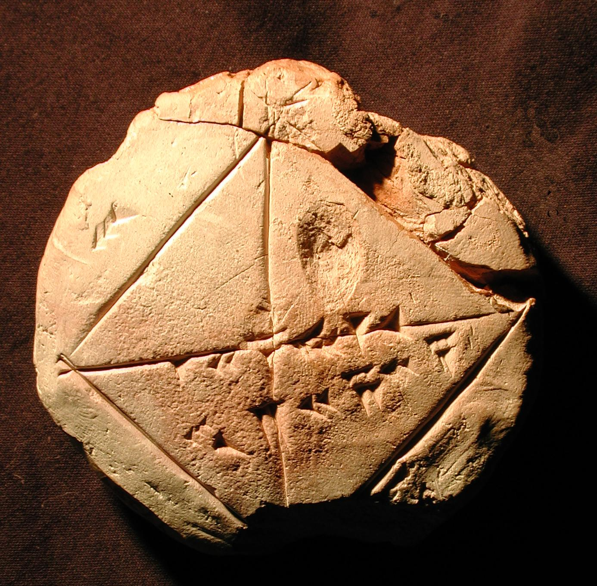

# 알고리즘이란?

## 알고리즘 정의

* 문제를 풀기 위한 절차로 **"어떤 문제를 해결하기 위해 입력된 자료를 토대로 원하는 출력을 유도하는 규칙의 집합"**

## 알고리즘 어원

8 ~ 9세기에 활약했던 아라비안 수행자 알 콰리즈미(Al-Khwarizmi)이 자신의 저서 "Calculation with Indian Numberals"을 통해 아라비아 수학을 유럽에 널리 전했다. 
이 책은 12세기 라틴어로 번역되었을 때 제목이 "Algoritmi de numero indorumi" 이다. 
라틴어로 그의 이름 Algoritmi(알고리트미)를 아라비아 순자에 의한 계산법을 의미하는 일반 명사 algorithm(알고리즘)으로 바뀐 것이다.

## 알고리즘과 프로그램 차이

알고리즘은 프로그램보다 더 추상적인 개념으로 알고리즘은 문제 해결을 위한 ```작업 절차```로 절차를 실행하는 수단은 언급하지 않는다. 
알고리즘을 실제로 실행할 수 있는 형태로 구현한 것이 프로그램이다. 

일반적으로 알고리즘을 실행하는 주체는 사람이다. 
컴퓨터가 만들어지기 전 프로그램은 사람이 수행할 "작업 지시서" 가 될 것이다. 
주판을 사용하여 두자리 정수 AB와 CD를 곱하는 알고리즘을 구하는 프로그램은 ```(A*C*100)+(B*C*10)+(A*D*10)+(B*D)``` 의 절차이다.
기계식 계산기가 등장하였을 때 알고리즘을 구현하는 프로그램은 "톱니 바퀴와 같이 계산에 필요한 부품을 배치하는 것"으로 표현되고 
초기 전자식 계산기에서는 프로그램이 "논리 다바이스들 간의 배선" 으로 표현되었고
컴퓨터의 성능이 향상되면서 프로그래밍 언어로 알고리즘을 표현하게 되었다.

## 알고리즘의 역사

문헌에 기록된 가장 오래된 알고리즘은 고대 그리스 수학자 유클리드가 두 자연수의 최대 공약수를 구하는 유클리드 호제법(Euclidean Algorithm)이다.

```bash
1. 두 개의 자연수 중 큰 수를 피제수(나누어 지는 수), 작은 수를 제수(나누는 수)라 한다.
2. 큰 수를 작은 수로 나눈다. 
3. 2의 연산의 나머지가 0 이면 작은 수가 최대공약수가 된다. (종료)
4. 2의 연산의 나머지가 0이 아니면 2의 작은 수(제수)를 피제수로, 나머지를 제수로 한다.
5. 다시 2번으로 돌아간다.
```

유클리드 호제법을 C++ 프로그램 언어로 표현한 함수의 예는 다음과 같다.
```c++
//
// 반복문을 활용한 유클리드 호제법을 이용한 최대 공약수 구하는 함수 
//
int gcd(int dividend, int divider){
	int residual = dividend % divider;

	while(residual != 0) {
		dividend = divider;
		divider = residual;
		residual = dividend % divider;
	}
	return divider;
}
````
반복문으로 작성한 코드를 재귀합수로 작성하면 다음과 같다. 

```c+
int reculsive_gcd(int x, int y){
	if(y == 0)
		return x;
	else return reculsive_gcd(y, x%y);
}
```

## 컴퓨터 이전의 알고리즘 

알고리즘은 문제를 해결하는 처리 절차로 실행하는 수단과는 관계가 없어서 복잡한 알고리즘아라도 손으로 직접 실행할 수 있다. 
컴퓨터 이전의 알고리즘 중 하나로 기원전 1900년 경의 것으로 확인되는 바빌론의 점토판(YBC7289)이 있다(아래의 그림). 
점토판에는 정사각형과 대각선이 그려져 있고 쐐기 문자로 '30', '1 24 51 10', '42 25 35'의 60진법의 수 세 개가 적혀 있다.
'30'은 10진수로 180, '1 24 51 10'은 10진수로 1.41421297로 ```sqrt(2)``` 에 가까운 값이고 '42 25 35'는 10진수로 42.42389 로 30\*sqrt(2)에 가까운 값이다. 
비빌로니아인은 정사각형에서 대각선의 길이가 한 변 길이의 sqrt(2) 배라는 것이 기반하여 제곱근의 근사값을 구하는 알고리즘을 사용했다고 추정하고 있다. 

<figure>

<figcaption align="center">바빌로 점토판(YBC7289)-(출처: Yale Babylonian Collection)</figcaption>
</figure>

우리가 사용하는 로그표는 로그의 고안자 중 한 사람인 네이피어(John Napier)가 20년 동안 직접 손으로 작성을 하였다. 미국에서 20세기 부터 뉴딜 정책의 일자리 창출 사업의 일환으로 수학 조견보 작성 프로젝트를 시작하여 수학에서 필요한 각종 수학 조견표(거듭 제곱, 로그 등)를 만들었다. 

또한 제 2차 세계 대전 중 독일의 애니그마 암호를 해독하기 위해 많은 암호 해독자들이 브래츨리 파크에 모여 방대한 알고리즘을 손으로 직접 실행하였다.
그러나 이처럼 사람의 순으로 알고리즘을 실행하는 것은 실행 속도와 정확성에서 한계가 존재하기 떄문에 사람들은 알고리즘을 정확하고 빠르게 실행하는 기계를 필요하게 되었다. 
그 결과 19세기 찰스 베비지가 구상한 자분 기관(difference engine)과 톱니바퀴 등의 부품을 이용한 기계식 계산기가 등장하였다.  

그 후 20세기에 들어서 ABC(Atanasoff-Berry Computer)와 ENIAC(Electronic Numerical Integrator and Computer)등의 전자 계산기가 등장하면서 알고리즘 실행 기계를 가지게 되었다. ENIAC과 같은 컴퓨터는 기존의 기계식 계산기보다 1,000배 정도 빠르고 실제로 엄청난 알고리즘 실행 농력을 가지고 있다. 

## 알고리즘 설계와 실행의 차이 

